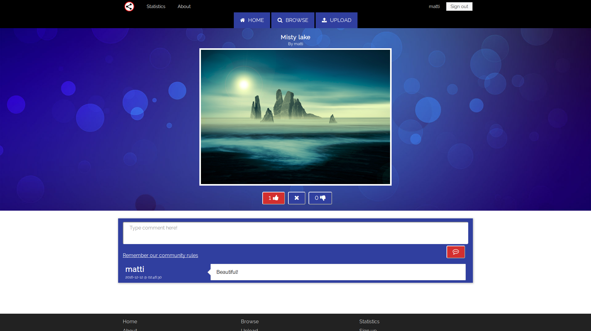

# MetroShare

MetroShare is a social image sharing website where users can upload,
discuss and like others' images. MetroShare is built with Java EE and GlassFish.




## Requirements & Dependencies

* GlassFish Server: Tested with 4.1. Other versions untested.
* Java JDK 7 or newer.
* MySQL/MariaDB database.
* Linux or MacOS with a system temporary directory located at /tmp.

## Installation

### 1. Clone the project

```sh
git clone git@github.com:/jukump/metroshare.git
```

### 2. Configure a GlassFish server

The project is built using GlassFish, which means you will need a running
instance of GlassFish in order to run the project.

**NetBeans:** Go to Tools --> Servers and fill out your GlassFish server details.

**IntelliJ IDEA:** Go to Run --> Edit Configurations and fill out your
GlassFish server details.

### 3. Set up a database

First, import the `sql/metro_share.sql` file to your database.

Next, Fill out your database credentials in
`web/WEB-INF/glassfish-resources.xml`.


### 4. Run the project

**NetBeans:** Go to Run --> Run Main Project.

**IntelliJ IDEA:** Go to Run --> Run...

This should open the project in your default web browser.

**Note**: Depending on your IDE settings, you may have to append *webresources*
to the current URL to view the project in your browser.
